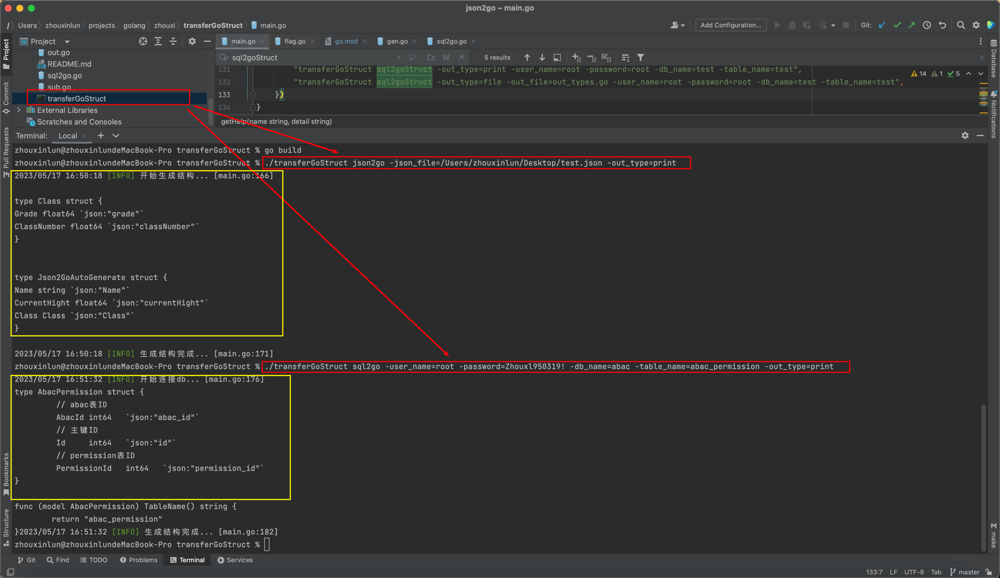

# transferGoStruct
### 一、项目说明：
json/sql转换golang struct工具
### 二、使用说明：
#### 1）插件构建
    1、go mod init github.com/zhouxinlun/transferGoStruct \
    2、go mod tidy \
    3、go build
#### 2）插件命令

    Usage: transferGoStruct <command> 
    
    Commands: 
    v       查看当前版本号 
    help    查看帮助信息 
    json2go 根据json文件自动生成struct 
    sql2go  根据db_sql连接自动生成struct 
    
    Options: 
    -json_file       json2go: json文件, 默认json文件为json2go.json 
    -out_type        输出类型, 默认输出方式为输出到文件file/可选print、file 
    -out_file        输出文件, 默认输出文件为gen_json2go_types.go 
    -user_name       sql2go: 用户名, 默认root 
    -password        sql2go: 密码, 默认'' 
    -host    sql2go: db连接地址, 默认127.0.0.1:3306 
    -charset         sql2go: 编码集, 默认utf8mb4 
    -db_type         sql2go: 连接类型, 默认mysql 
    -db_name         sql2go: 数据库名称, 默认'' 
    -table_name      sql2go: 表名, 默认'' 
    
    Examples: 
    transferGoStruct json2go 
    transferGoStruct json2go -out_type=print 
    transferGoStruct json2go -out_type=file 
    transferGoStruct json2go -out_type=file -out_file=out_types.go 
    transferGoStruct sql2go -out_type=print -user_name=root -password=root -db_name=test -table_name=test 
    transferGoStruct sql2go -out_type=file -out_file=out_types.go -user_name=root -password=root -db_name=test -table_name=test 
### 三、代码说明：
    该代码是我在github转换示例中扩展出来的，主要功能目前只实现了json -> struct，sql -> struct，
    思路是利用终端命令行参数初始化设定，并进行不同类型切换不同方式转换struct，
    源码让我上传到了github上可以自行拉取：git@github.com:zhouxinlun/transferGoStruct.git
    该工具接下来的扩展思路可以在sql转换上进一步优化，或者在配置方式上利用配置文件的方式，或者实现多张表的转换，又或者在struct结构体中的细节更加明确
